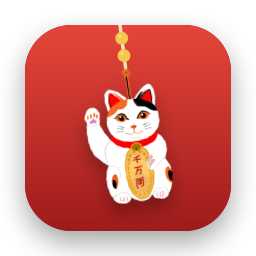
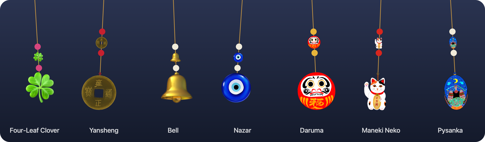

<p align="center">
  
</p>

<h1 align="center">Tassel</h1>

<p align="center">A hand-drawn lucky charm that hangs from your Mac's menu bar.</p>

<p align="center">
  
  
  <a href="LICENSE"></a>
  <a href="https://buymeacoffee.com/desilvas20l"></a>
</p>



- **Moves like a real charm.** It sways while you work and swings when you bat it.
- **Charms from around the world,** most of them hand-drawn, each with its own little ritual.
- **Stays out of your way.** No Dock icon, no window; clicks pass straight through.
- **Free and open source.** No account, no ads, nothing sent anywhere.

## What you need

- A Mac with **macOS 14 Sonoma** or newer, Apple Silicon or Intel
- [Homebrew](https://brew.sh)

## Install

```bash
brew tap desilva23/tassel https://github.com/desilva23/Tassel
brew install tassel
```

Then open **Tassel** from Spotlight. Update with `brew upgrade tassel`.

## Using it

| To | Do this |
|---|---|
| Swing it | Click the charm, or press <kbd>⌥</kbd><kbd>⌘</kbd><kbd>L</kbd> |
| Pull it and let it spring back | Drag the charm |
| Move it along the menu bar | Drag the rope |
| Do its ritual | Right-click the charm |
| Change the charm, size or spot | Click Tassel in the menu bar |

## The charms

| Charm | Ritual |
|---|---|
| Daruma | Paint one eye when you make a wish, the other when it comes true |
| Maneki Neko | Polish the Koban, every 9 days |
| Pysanka | Write a New One, once a year |
| Yansheng | Re-tie the Red Thread, every 21 days |
| Nazar | Turn Back the Eye, every 10 days |
| Bell | Ring It, every 3 days |
| Four-Leaf Clover | Press a New One, every 14 days |

Skip a ritual and the charm slowly fades; do it and it comes back. Any emoji can
hang there too.

## Support

Tassel is free. If it brings you luck, [buy me a coffee](https://buymeacoffee.com/desilvas20l).

## Contributing

Draw a charm: [ASSETS.md](ASSETS.md) · Build it and read how it works: [DEVELOPMENT.md](DEVELOPMENT.md)

## Licence

Code: [MIT](LICENSE) · Drawings: © Desilva Stalin, [CC BY-NC 4.0](LICENSE-ART)
